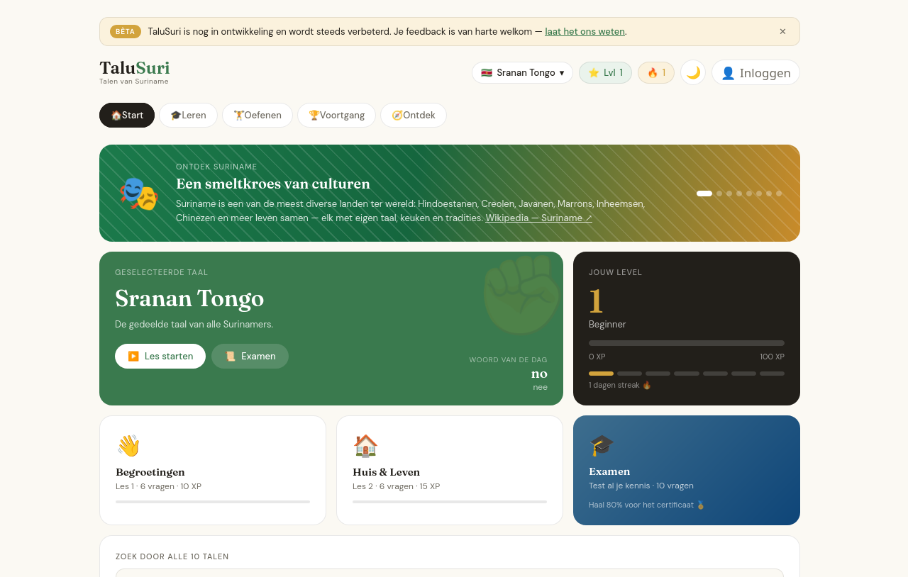
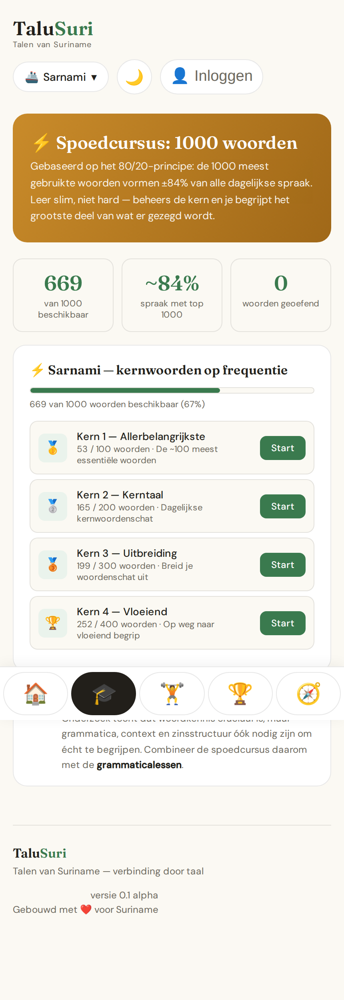

# TaluSuri — Talen van Suriname

A browser-based app for learning the **9 languages of Suriname** and bringing its
communities closer together through language. Duolingo-style lessons, flashcards,
a dictionary, grammar notes, a frequency-based crash course and gamification (XP, levels,
streaks, badges). The core app is a single static site that runs
with **no backend**; an optional **Supabase** layer adds user accounts, a real
leaderboard, and community-contributed pronunciations.

The interface is in **Dutch**. The vocabulary is drawn from published academic
dictionaries (see the in-app *Bronnen* page and [Data & sources](#data--sources)).

> **Status:** Alpha v0.1. Vocabulary and audio are being refined — feedback,
> recordings and native-speaker contributions are very welcome via the in-app
> *Community* page.





## Languages covered

Sarnami Hindoestani · Sranan Tongo · Surinaams-Javaans · Ndyuka · Saramaccaans ·
Arawak (Lokono) · Kari'na · Hakka · Matawai

## Features

- **Lessons & exams** — auto-generated exercises (multiple choice, type-in, listen-and-choose)
- **Flashcards** with reveal + self-scoring
- **Dictionary** per language and a **global search** across all 9 languages
- **Grammar** notes per language (with a generic fallback)
- **Crash course** — core vocabulary grouped into frequency tiers (80/20 principle)
- **Curriculum** — a guided learning path combining vocab, grammar and exams
- **Gamification** — XP, levels, daily streaks, achievement badges, a leaderboard
- **My mistakes** — wrong answers are collected for focused review
- **Text-to-speech** pronunciation via the browser Speech Synthesis API
- **Help section** — replay the onboarding tutorial and learn how to add pronunciations
- **Light / dark theme**, fully responsive (desktop top-bar, mobile bottom-nav)
- **Offline-friendly persistence** — progress is stored in `localStorage`

### Community & accounts (optional, via Supabase)

These activate when Supabase keys are present in `assets/js/config.js`; without
them the app runs fully anonymous and these controls hide gracefully.

- **Accounts** — **email + password** login; display name set on first login
- **Real leaderboard** — accounts ranked by XP, progress synced across devices
- **Profile pictures** — upload an avatar; the default is the first letter(s) of your name
- **Community pronunciations** — record a word **in-browser** (with file-upload fallback);
  recordings are stored in Supabase Storage
- **Up/down voting** — rate pronunciations 👍 / 👎 (or 🤷 skip), including a **Tinder-style
  swipe deck** on the Community page to vote through clips quickly; net score ranks them
- **Contributor badges** — earned by total net upvotes on your recordings (🎤 first → 🌟 25 → 👑 100)
- **Official pronunciations** — an **admin** can promote a recording (net ≥5 upvotes) to
  replace the robotic text-to-speech for that word
- **Validation & feedback** — flag incorrect entries and a contact form (wired for Netlify Forms)

## Project structure

```
talusuri/
├── index.html              # Markup only — view containers, onboarding, modals
├── assets/
│   ├── css/
│   │   └── styles.css       # All styling (theme variables, layout, components)
│   └── js/
│       ├── config.js        # Supabase URL + publishable key (blank = anonymous mode)
│       ├── data.js          # Datasets: languages, words, phrases, sources, badges, leaderboard
│       ├── state.js         # App state, localStorage persistence, theme & level helpers
│       ├── app.js           # UI rendering, lessons/exams, navigation, features & init
│       ├── auth.js          # Supabase email+password auth + leaderboard sync
│       ├── community.js     # Recordings, up/down voting, swipe deck, profile pics, badges
│       └── admin.js         # Admin panel: promote a recording to official pronunciation
├── supabase/
│   ├── schema.sql           # profiles table + RLS (accounts & leaderboard)
│   ├── community.sql        # recordings, votes, admins, is_admin(), storage policies
│   └── votes_value.sql      # signed vote values (+1/-1) + recording_scores view
└── README.md
```

### A note on the architecture

The JS files are loaded as **classic scripts in order** (`config.js` → `data.js` →
`state.js` → `app.js` → `auth.js` → `community.js` → `admin.js`) and share the global
scope. This is intentional: the markup uses inline `onclick="…"` handlers, which require
the functions to be global. Load order matters — `state.js` initialises state from the
datasets in `data.js`, `app.js`'s trailing `init()` boots the app, and `auth.js` exposes
the shared Supabase client (`window.SB`) that `community.js`/`admin.js` reuse. When adding
new content (a language, grammar section, culture fact), put the **data** in `data.js` or
beside its feature in `app.js`, and keep the **rendering logic** in `app.js`.

The Supabase layer is **optional and isolated**: if `config.js` has no keys, `auth.js`
sets everything to anonymous mode and the community/account controls hide. Privileged
actions (own-row writes, admin promotion) are enforced by **Row Level Security**, not by
client checks — the publishable key is safe to ship.

## Running locally

It's a static site — any static file server works. From the project root:

```bash
python3 -m http.server 8000
# then open http://localhost:8000
```

> Open it through a server (not `file://`) so recording and form `fetch` behave
> correctly. In-browser recording needs `https://` or `localhost` (secure contexts).

## Backend setup (Supabase — optional)

The app runs without this. To enable accounts, the real leaderboard and community
pronunciations:

1. Create a free **Supabase** project.
2. **Authentication → Providers → Email:** keep Email enabled and turn **off "Confirm
   email"** so email+password signup logs in instantly (no emails sent → no rate limit).
3. **Storage:** create two **public** buckets — `pronunciations` and `avatars`.
4. **SQL Editor:** run the migrations in order — `supabase/schema.sql`,
   `supabase/community.sql`, `supabase/votes_value.sql`, `supabase/leaderboards.sql`,
   then `supabase/beta_cap.sql` (closed-beta 50-account cap).
5. Add admins by inserting their email into the `admins` table (seeded in `community.sql`).
6. Put the **Project URL** and **anon/publishable key** into `assets/js/config.js`.

The publishable key is public by design; all access is constrained by the RLS policies
in the migrations. Never put the `service_role` key in client code.

### Authentication

Login is **email + password** (`signUp` / `signInWithPassword`). With **"Confirm email"
off** (step 2) no emails are ever sent, so there's no email-rate-limit to hit. If you'd
rather require verification, turn "Confirm email" back on and add a free custom SMTP
provider (e.g. [Brevo](https://www.brevo.com) — 300/day, or [Resend](https://resend.com))
under **Authentication → SMTP Settings**, since the built-in email caps sends at a few
per hour. Password reset (optional) also needs SMTP.

## Deployment

Deploy the folder to any static host (Netlify, GitHub Pages, Cloudflare Pages, …).
The contact form is wired for **Netlify Forms** (`data-netlify="true"` + a honeypot
field); it submits silently and degrades gracefully on other hosts. A local backup of
each submission is also kept in `localStorage`. If you use the Supabase layer, make sure
the deployed origin is in the Supabase redirect allowlist (step 2 above).

## Data & sources

Vocabulary is based on published dictionaries and academic references (e.g. SIL, KITLV,
Instituut voor Taalwetenschap Paramaribo). The full per-language source list is shown on
the in-app *Bronnen* page and defined in `assets/js/data.js`. Documentation for the
Indigenous and Maroon languages is more limited; contributions from native speakers are
explicitly invited.

## Contributing

Found a wrong translation or want to help as a native speaker? Use the **Community** page
in the app to flag entries or send a message. Code/data contributions are welcome via
pull request — keep datasets in `data.js` and rendering in `app.js`.

---

Built with ❤️ for Suriname — verbinding door taal.
